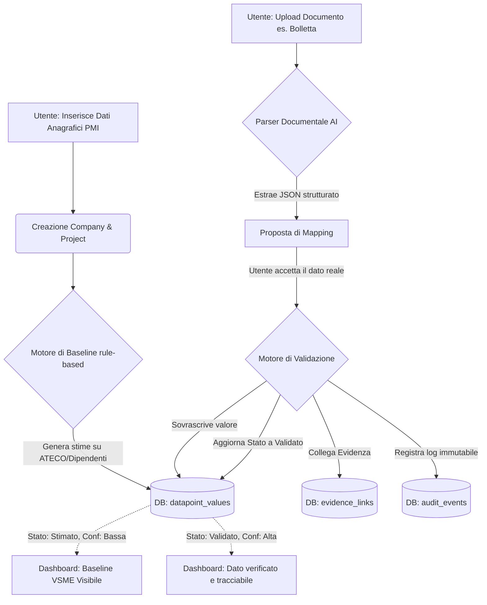

# SustainChain - Logica Funzionale "Fase -1" (Demo Nucleo)

Questo documento spiega l'architettura logica e funzionale implementata per il prototipo dimostrabile (Fase -1), in stretta aderenza con la documentazione strategica e tecnica di progetto (in particolare il *Doc 2 Tecnico* e le direttive operative aggiornate a maggio 2026).

## Obiettivi della Fase -1

L'obiettivo non è costruire una piattaforma SaaS completa, né un modello di machine learning complesso o un motore di reporting estetico. L'unico obiettivo è **dimostrare tecnicamente il valore differenziante di SustainChain**:
Il passaggio verificabile da una **Baseline Stimata** (il "foglio bianco" riempito) a un **Dato Validato** (basato su evidenze documentali), garantendo la totale tracciabilità (**Audit Trail**).

Questa logica costituisce il nucleo del "Preparation Layer" ed "Evidence Layer" delineato nella documentazione.

## Cosa è stato implementato

Al momento, per garantire massima velocità, stabilità e type-safety, il motore è stato costruito con:
- **Next.js (App Router)** per l'infrastruttura backend/server-actions.
- **Neon (PostgreSQL Serverless)** per il database.
- **Drizzle ORM** per la mappatura rigorosa in TypeScript dello schema dati.

### 1. Schema Dati Relazionale (Il "Ferro")
Lo schema (`src/db/schema.ts`) riflette il rigore richiesto dal dominio ESG:
- **`datapoints`**: Il "Knowledge Core" normativo (attualmente popolato con il modulo Basic VSME tramite script di seed).
- **`datapoint_values`**: Il livello cliente. Ogni dato possiede obbligatoriamente uno `state` (Stimato, Dichiarato, Estratto, Validato) e una `confidence`.
- **`evidence_links`**: La tabella ponte che lega in modo indissolubile un dato approvato al documento sorgente (pagina inclusa).
- **`audit_events` e `validation_events`**: Il registro immutabile. Ogni transizione di stato o generazione di stima viene loggata per garantire la *data lineage*.

### 2. Motore di Baseline (`src/services/baseline.ts`)
Implementa il concetto di "Pre-compilazione intelligente".
Al momento della creazione dell'azienda, invece di interrogare un inesistente modello ML, il sistema applica **regole di stima hard-coded** (es. stima dei consumi elettrici basata su codice ATECO e numero dipendenti).
- **Perché**: Per mostrare subito all'imprenditore uno "scheletro" di sostenibilità e abbattere l'inerzia.
- **Azione**: Popola il database con record in stato `Stimato` (confidence Bassa) e scrive la motivazione nell'audit trail.

### 3. Parser Documentale (`src/services/document-parser.ts`)
L'interfaccia dell'agente estrattore.
Riceve un documento (es. bolletta, registro rifiuti) e tramite un LLM (prompt strutturato) estrae un JSON rigoroso contenente valore, unità e riferimento alla pagina.
- **Perché**: Trasforma documenti destrutturati (il caos della PMI) in dati mappati sui datapoint VSME.
- **Stato**: Attualmente implementato come *stub/simulazione* pronto per essere collegato all'SDK Vercel AI (Claude/Groq) non appena verrà gestito l'upload fisico del file.

### 4. Motore di Validazione (`src/services/validation.ts`)
Il cuore dell'ecosistema. Questa logica viene scatenata quando l'utente (Human-in-the-loop) accetta il dato estratto dal Parser per sostituire la stima iniziale.
- **Azione**: 
  1. Cambia lo stato del `datapoint_value` da `Stimato` a `Validato`.
  2. Crea il record in `evidence_links` verso l'ID del documento caricato.
  3. Scrive l'evento in `validation_events` e `audit_events`.
- **Perché**: È la "promessa" di SustainChain. Il dato non è mai un numero isolato; è sempre supportato da una prova documentale e tracciato nel tempo.

---

## Schema Logico Funzionale del Flusso

## Prossimi Passi (Settimana 3)
1. **Infrastruttura di Upload**: Implementare il caricamento fisico dei file PDF/Immagini (tramite Vercel Blob o storage locale temporaneo).
2. **Aggancio LLM**: Connettere l'API di Claude (o Groq) al `document-parser.ts` per far analizzare i file reali caricati.
3. **Interfaccia di Validazione**: Creare il componente UI (la schermata 4 della demo) che affianca il dato "Stimato" al dato "Estratto", permettendo il click sul tasto "Valida".
